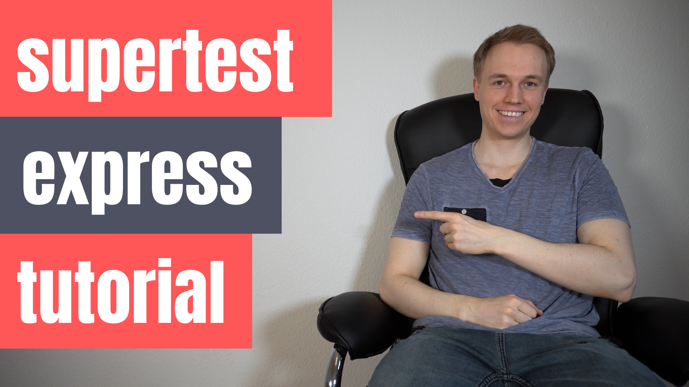

# Node supertest tutorial

This tutorial demonstrates how to use [supertest](https://github.com/visionmedia/supertest) with [JEST](https://jestjs.io/) to do integration testing with an [express server](https://expressjs.com/).

<h3 align="center">Please help this repo with a ⭐️ if you find it useful! 😁</h3>

This repository is contains the code for the [Node supertest video tutorial](https://www.youtube.com/watch?v=T2sYitv2OAY)

Please also check out my website at [jangoebel.com](https://jangoebel.com)

For updates, please follow [@_jgoebel](https://twitter.com/_jgoebel) on Twitter.

## Running this project

1. `npm i`
2. `npm run dev` starts up a hot-reload express webserver on port 8080
